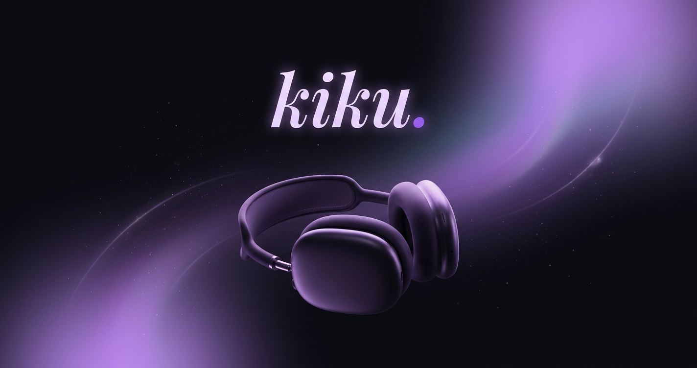

# kiku. — made for late-night listening

Beautiful, fast, mobile-first music player for late-night listening. Search, play, download, Apple Music-style lyrics, queue with drag-reorder & swipe-remove.

**Live:** https://kiku.is-a.dev (after domain setup) • Fallback: `kiku.vercel.app`



## Features

- 🔍 Search via JioSaavn, instant play
- 🎵 Download 320kbps with toast feedback
- 🎤 Apple Music-style synced lyrics (LRCLIB)
- 📋 Queue — drag to reorder, swipe to remove, autoplay suggestions
- ❤️ Liked & Recent persisted locally
- 📱 PWA installable, offline image caching, 90+ Lighthouse
- ⌨️ Shortcuts: Space, /, Q, ⌘K, Esc
- 🎨 React Bits (GlassSurface, Aurora, SpotlightCard, BlurText), late-night vibe
- 🔗 Dynamic OG image per track (canvas 1200x630) for WhatsApp/Twitter shares
- 📄 About page with 300+ words for SEO

## Tech

React 19 + TS, Zustand, Motion, OGL, Tailwind v4, Vite + VitePWA

## Quick Start

```bash
npm install
npm run dev
npm run build
```

## Deploy

### Vercel (instant)
```bash
npm i -g vercel
vercel --prod
```

### Free hot domain kiku.is-a.dev

1. Fork https://github.com/is-a-dev/register
2. Create `domains/kiku.json`:

```json
{
  "owner": { "username": "YOUR_GITHUB", "email": "you@email.com" },
  "record": { "CNAME": "cname.vercel-dns.com" },
  "proxied": true
}
```

3. PR → merged in hours
4. Vercel Dashboard → Settings → Domains → Add `kiku.is-a.dev` (auto SSL)

See `docs/DOMAIN.md` for details.

## SEO

- Title, description, keywords, canonical, OG, Twitter, JSON-LD WebApp + MusicGroup + MusicRecording per track
- `public/robots.txt`, `sitemap.xml` (/, /?view=about, /?view=recent, /?view=liked)
- `?track=ID` deep link, dynamic OG canvas, preconnects, no visible ads (meta tags only)

Post-deploy:
1. Add GSC verification meta in `index.html`
2. Submit sitemap to GSC
3. Add GA4 ID if needed (commented placeholder)

## Structure

```
src/
  components/kiku/
    library/TrackRow (srcset)
    player/MiniPlayer, ExpandedPlayer (srcset, toast), AppleLyrics, WaveformScrubber
    drawer/QueueDrawer (Reorder + swipe)
    pages/About
    ui/Toaster
  components/reactbits/
  stores/player, toast
  services/api (srcset), download (toast), 
  lib/ogImage (dynamic OG), utils
public/
  robots.txt, sitemap.xml, og-image.png, icons, _headers, _redirects, browserconfig.xml
```

## Ads

Meta tags only, no visible ad units. Placeholders in `index.html` commented for future `ca-pub-...`

Made with ❤️ by Ashar
